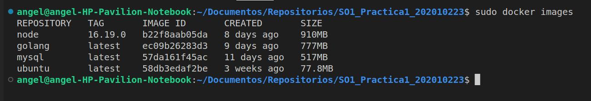
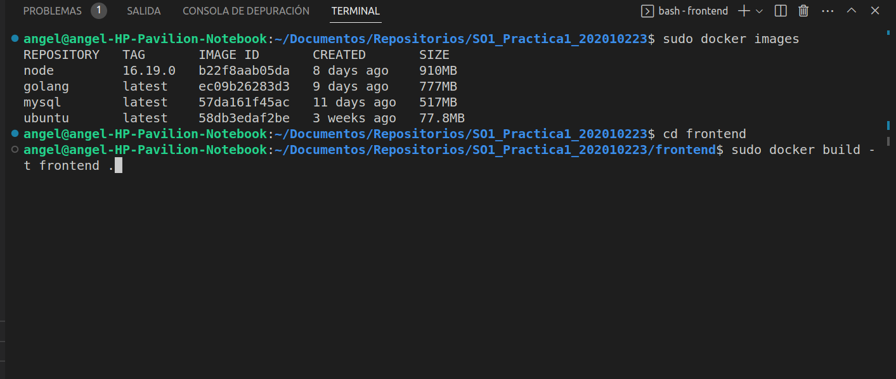
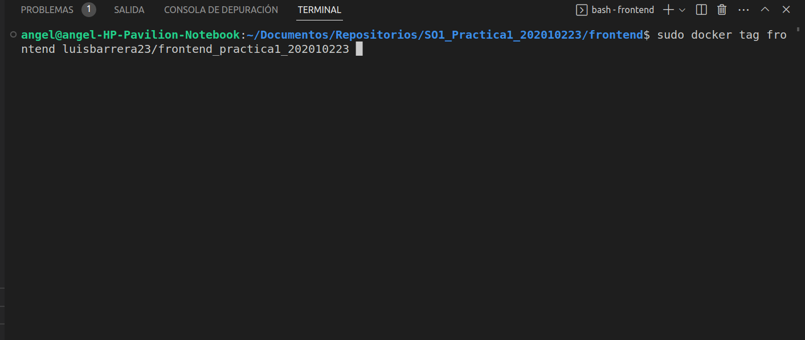

# Universidad de San Carlos de Guatemala
# Sistemas Operativos 1

# Practica 1 Contenedores de Docker
# Luis Angel Barrera Velásquez *202010223*

## Arquitectura utilizada para la solucion
Basicamente se utilizo una aplicacion completa de frontend, backend y base de datos, incluyendo una reporteria hecha con un script de bash cada una de las antes mencionadas herramientas fueron dockerizadas para utilizarla por medio de contenedores que mas adelante sera detallado. La arquitectura utilizada es la siguiente: 


A continuacion se explicara cada una de las capas del proyecto:

### Frontend [Repositorio](https://github.com/LuisBarrera23/SO1_202010223/tree/main/frontend)


Para el frontend fue utilizado React en la version node 16.19.0 creando el proyecto con el comando: 

```
creat-react-app myapp
```

Luego de crear el proyecto de React fue diseñada una pagina bastante sencilla de una calculadora basica con una tabla que muestra el historial de las operaciones que han sido realizadas.


### Backend [Repositorio](https://github.com/LuisBarrera23/SO1_202010223/tree/main/backend)


EL backend fue hecho utilizando goland para eso cabe mencionar que para hacer un router que responda dependiendo el endpoint que el frontend quiera se debe instalar diferentes librerias por medio de comandos los cuales se deben ejecutar antes de empezar a realizar el proyecto, sin embargo no es necesario volver a ejecutarlos al usar docker:

```
go get -u github.com/gorilla/mux
go get -u github.com/gorilla/handlers
```

### Script [Repositorio](https://github.com/LuisBarrera23/SO1_202010223/tree/main/scripts)

Esta capa es la mas sencilla del proyecto ya que esta lo unico que hace es tener un script con codigo para hacer reportes los cuales se hablara mas adelante. Se ejecuta un script para bash y este analiza un *archivo.txt* ubicado en el volumen que comparte con el contenedor del backend.


## Docker 


Como primer paso descargaremos las imagenes base de las herramientas que se utilizaran desde los repositorios publicos de docker hub, se debe de ejecutar cada uno de los siguientes comandos: 

```bash
sudo docker pull ubuntu
sudo docker pull node
sudo docker pull golang
sudo docker pull mysql
```

Podemos revisar despues que imagenes tenemos y nos deben aparecer las anteriormente descargadas:
```bash
sudo docker images
``` 



Para la realizacion de contenedores de tiene que tener instalado docker. A continuacion se presenta la explicacion de las imagenes y la construccion de los repositorios requeridos para hacer este proyecto.


### Imagen del Frontend [Repositorio](https://hub.docker.com/repository/docker/luisbarrera23/frontend_practica1_202010223/general)

primero que nada se debe crear un archivo *Dockerfile* con el siguiente contenido dentro de la carpeta del Frontend: 

```Dockerfile
FROM node:16.19.0

WORKDIR /front_app

COPY package.json ./
COPY package-lock.json ./

RUN npm install

EXPOSE 3000 

COPY . .

CMD ["npm", "start"]
```

Cabe recalcar que la instruccion *EXPOSE* dice el puerto en el que se levantara el servicio de React y el comando *RUN* es para que ejecute el comando para inicializar y ejecutar el proyecto de React.

Una vez creado el archivo procedemos a crear la imagen y subirla a docker hub con los siguientes comandos ejecutandolos en la ubicacion de la carpeta frontend: 

```bash
sudo docker build -t frontend .
``` 



Creamos un tag con el que se subira al repositorio. 

```bash
sudo docker tag frontend luisbarrera23/frontend_practica1_202010223
``` 



Por ultimo subimos la imagen con el nuevo tag que creamos: 

```bash
sudo docker push luisbarrera23/frontend_practica1_202010223
``` 


## Imagen del Backend [Repositorio](https://hub.docker.com/repository/docker/luisbarrera23/backend_practica1_202010223/general)

primero que nada se debe crear un archivo *Dockerfile* con el siguiente contenido dentro de la carpeta del Backend: 

```Dockerfile
FROM golang

WORKDIR /backend_app

COPY . .

RUN go mod download

EXPOSE 5000

CMD ["go", "run", "main.go"]
```
Cabe recalcar que la instruccion *EXPOSE* dice el puerto en el que se levantara el servicio del servidor hecho en golang y el comando *RUN* es para que ejecute el comando para inicializar y ejecutar el archivo `main.go`.

Una vez creado el archivo procedemos a crear la imagen y subirla a docker hub de la misma forma que subimos la imagen del frontend ejecutando cada uno de los siguientes comandos en su respectivo orden ubicandonos en la carpeta del backend: 

```bash
sudo docker build -t backend .
``` 


Creamos un tag con el que se subira al repositorio. 

```bash
sudo docker tag backend luisbarrera23/backend_practica1_202010223
``` 

Por ultimo subimos la imagen con el nuevo tag que creamos: 

```bash
sudo docker push luisbarrera23/backend_practica1_202010223
``` 


## Imagen del Script [Repositorio](https://hub.docker.com/repository/docker/luisbarrera23/script_practica1_202010223/general)

primero que nada se debe crear un archivo *Dockerfile* con el siguiente contenido dentro de la carpeta del *scripts*: 

```Dockerfile
FROM ubuntu:latest

# COnfiguracion para la zona horaria
RUN apt-get update && apt-get install -y tzdata bash
#Fijamos la zona horaria 
RUN ln -sf /usr/share/zoneinfo/America/Guatemala/etc/localtime
#Se crea un entorno con la hora que debe de ser para Guatemala
RUN echo "export CURRENT_TIME=$(date '+%Y-%m-%d %H:%M:%S')" >> /root/.bashrc

# && apt-get install jq -y && apt-get install -y curl

COPY . .

RUN chmod +x ./script.sh

CMD ["/bin/bash", "-c", "source /root/.bashrc && ./script.sh"]
```
Cabe recalcar que la instruccion *RUN* es para que ejecute el comando para inicializar y ejecutar el archivo `script.sh` dentro de la imagen de ubuntu antes descargada y ademas de eso se realizaron algunas configuraciones investigadas para la correcta configuracion de la zona horaria de Guatemala ya que sin esto estara desconfigurada la hora de los reportes y puede no funcionar de manera coherente de la hora del usuario.

Una vez creado el archivo procedemos a crear la imagen y subirla a docker hub de la misma forma que subimos la imagen del frontend ejecutando cada uno de los siguientes comandos en su respectivo orden ubicandonos en la carpeta del script: 

```bash
sudo docker build -t sp .
``` 


Creamos un tag con el que se subira al repositorio. 

```bash
sudo docker tag sp luisbarrera23/script_practica1_202010223
``` 

Por ultimo subimos la imagen con el nuevo tag que creamos: 

```bash
sudo docker push luisbarrera23/script_practica1_202010223
``` 


## Archivo Docker-compose.yml

Este archivo basicamente se encarga de ejecutar un proyecto que tiene varios contenedores y en este se definen todos los servicios que se requieren, para esta practica se realizo el siguiente archivo *docker-compose.yml*: 

```yaml
version: "3"

services:
  db:
    container_name: mysql-db
    image: mysql
    restart: always
    environment:
      MYSQL_ROOT_PASSWORD: '1234'
      MYSQL_DATABASE: 'logs'
      MYSQL_PASSWORD: '1234'
      
    ports:
      - '3306:3306'
    expose:
      - '3306'
    volumes:
      - ./backend/db_data:/var/lib/mysql

  backend:
    #build: ./backend
    container_name: backendProduccion
    restart: always
    image: luisbarrera23/backend_practica1_202010223
    ports:
      - "5000:5000"
    environment:
      TZ: America/Guatemala
    depends_on:
      - db
    links: 
      - db
    volumes:
      - ./backend/Registros:/registros
  front:
    #build: ./frontend
    container_name: frontendProduccion
    restart: always
    image: luisbarrera23/frontend_practica1_202010223
    ports:
      - "3000:3000"
    depends_on:
      - backend
    links: 
      - backend

  script: 
    #build: ./scripts
    image: luisbarrera23/script_practica1_202010223
    # restart: always
    container_name: scriptProduccion
    environment:
      TZ: America/Guatemala
    volumes:
      - ./backend/Registros:/registros

  
volumes:
  db_data:
  Registros:

```

Lo ultimo del archivo *docker-compose.yml*  llamado volumenes es para poder crear directorios compartidos en este caso el backend y el contenedor de la base de datos contendran el mismo volumen.

## Imagen de MYSQL 

Para la creacion de esta imagen no se crea de manera manual sino que se crea automaticamente con los parametros que se le ponen en el servicio del archivo *docker-compose.yml* al poner lo siguiente: 


```yaml
db:
    container_name: mysql-db
    image: mysql
    restart: always
    environment:
      MYSQL_ROOT_PASSWORD: '1234'
      MYSQL_DATABASE: 'logs'
      MYSQL_PASSWORD: '1234'
      
    ports:
      - '3306:3306'
    expose:
      - '3306'
    volumes:
      - ./backend/db_data:/var/lib/mysql
```


Para levantar el proyecto completo se debe ejecutar el docker-compose con el siguiente comando al mismo nivel del archivo *docker-compose.yml*: 

```bash
sudo docker-compose up -d
```

Si es la primera vez que se ejecuta el *docker-compose* se debe crear la base de datos para ello se debe de crear la tabla de la base de datos. Para comenzar debemos acceder al contenedor de la base de datos MYSQL:

```
sudo docker exec -it mysql-db mysql -uroot -p1234
```

luego ejecutamos los siguientes comandos en el orden dado: 

```
USE logs;
```

```
CREATE TABLE registros(
id int NOT NULL AUTO_INCREMENT,
numero1 VARCHAR(255) NOT NULL,
numero2 VARCHAR(255) NOT NULL,
operacion VARCHAR(255) NOT NULL,
resultado VARCHAR(255) NOT NULL,
fecha VARCHAR(255) NOT NULL,
PRIMARY KEY (id)
);
```

Con la tabla creada ya funciona de manera correcta todo el proyecto de diferentes contenedores. 


