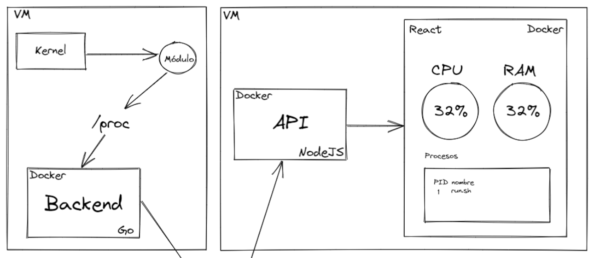
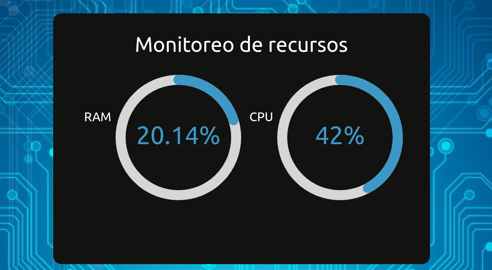
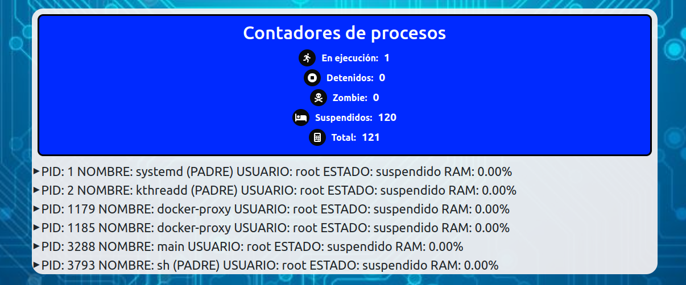
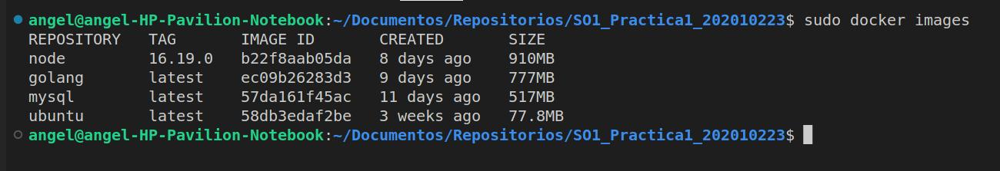
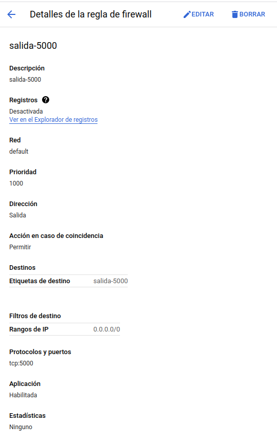
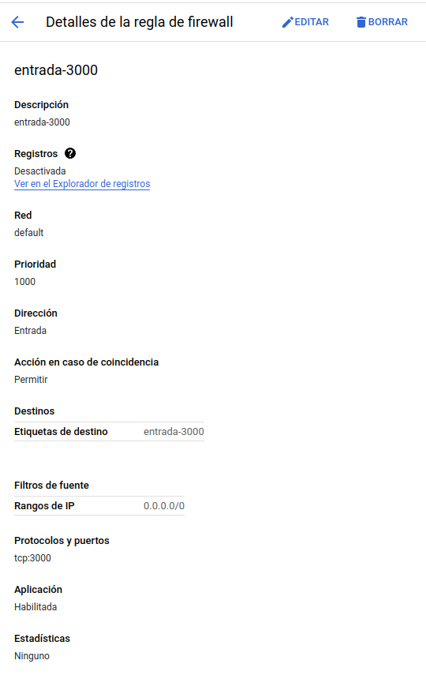
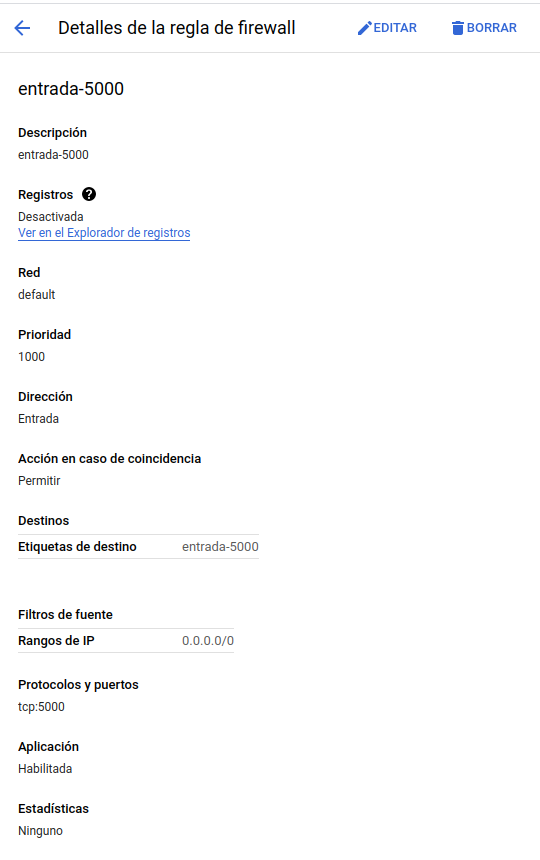

# Universidad de San Carlos de Guatemala
# Sistemas Operativos 1

# Practica 2 Monitoreo de Recursos
# Luis Angel Barrera Velásquez *202010223*

## Arquitectura utilizada para la solucion
Basicamente se utilizo una aplicacion completa de frontend en react complementada con un backend en Nodejs en una maquina virtual de GCP y modulos de kernel complementado de un backend en go en otra maquina virtual de GCP para esto ambos backend guardan y leen datos en una base de datos en GCP en este caso el backend en go guarda y el backend en Nodejs lee datos: 



A continuacion se explicara cada una de las capas del proyecto:

### Frontend [Repositorio](https://github.com/LuisBarrera23/SO1_202010223/tree/main/frontend)


Para el frontend fue utilizado React en la version node 16.19.0 creando el proyecto con el comando: 

```
creat-react-app myapp
```

Luego de crear el proyecto de React fue diseñada una pagina bastante sencilla de una intefaz de graficas mostrando el porcentaje de ram y cpu con un visualizador de procesos actuales y que se actualizan cada 1 segundo.






### Backend GO [Repositorio](https://github.com/LuisBarrera23/SO1_202010223/tree/main/backend)


EL backend fue hecho utilizando goland para eso cabe mencionar que el funcionamiento general de este unicamente es leer cada 1 segundo el json de la informacion de la ram y del cpu de la carpeta /proc de la maquina virtual y lo envia a la base de datos la cual se explicara mas adelante.

### Backend Nodejs [Repositorio](https://github.com/LuisBarrera23/SO1_202010223/tree/main/scripts)

Esta api fue realizada con un router y lo unico que hace es leer la informacion de la base de datos y mandarla al frontend el cual despliega la informacion al usuario. El unico endpoint que se utiliza es el /all el cual obtiene los datos de ram y cpu de la base de datos.


## Docker 


Como primer paso descargaremos las imagenes base de las herramientas que se utilizaran desde los repositorios publicos de docker hub, se debe de ejecutar cada uno de los siguientes comandos: 

```bash
sudo docker pull node
sudo docker pull golang
```

Podemos revisar despues que imagenes tenemos y nos deben aparecer las anteriormente descargadas:
```bash
sudo docker images
``` 



Para la realizacion de contenedores de tiene que tener instalado docker. A continuacion se presenta la explicacion de las imagenes y la construccion de los repositorios requeridos para hacer este proyecto.


### Imagen del Frontend 


primero que nada se debe crear un archivo *Dockerfile* con el siguiente contenido dentro de la carpeta del Frontend: 

```Dockerfile
FROM node:16.19.0

WORKDIR /front_app

COPY package.json ./
COPY package-lock.json ./

RUN npm install

EXPOSE 3000 

COPY . .

CMD ["npm", "start"]
```

Cabe recalcar que la instruccion *EXPOSE* dice el puerto en el que se levantara el servicio de React y el comando *RUN* es para que ejecute el comando para inicializar y ejecutar el proyecto de React.


## Imagen del Backend GO


primero que nada se debe crear un archivo *Dockerfile* con el siguiente contenido dentro de la carpeta del Backend: 

```Dockerfile
FROM golang

WORKDIR /backend_app

COPY . .

RUN go mod download


CMD ["go", "run", "main.go"]
```
Cabe recalcar que  el comando *RUN* es para que ejecute el comando para inicializar y ejecutar el archivo `main.go`.

## Imagen del Backend Nodejs


primero que nada se debe crear un archivo *Dockerfile* con el siguiente contenido dentro de la carpeta del Backend de nodejs: 

```Dockerfile
# Version node
FROM node:18

#Creacion del directorio de trabajo
WORKDIR /app

#Copiando archivos con las librerias necesarias
COPY package.json ./
COPY package-lock.json ./

#Comando para instalar dependencias
RUN npm install

#Copiar las dependencias y archivos
COPY . .

#Puerto a exponer
EXPOSE 5000

CMD ["npm", "start"]
```
Cabe recalcar que  el comando *npm* es para que ejecute el comando para inicializar y ejecutar la api.


## Archivo Docker-compose.yml VM1

Este archivo basicamente se encarga de ejecutar el backend pero debe correrse de primero los modulos: 

```yaml
    version: "3"

services:
  backend:
    build: ./backend
    container_name: backendProduccion
    restart: always
    image: luisbarrera23/backend_practica2_202010223
    environment:
      TZ: America/Guatemala
    volumes:
      - /etc/passwd:/etc/passwd:ro
      - /proc:/host/proc:ro

```
Los volumenes del servicio backend son basicamente para poder tener acceso desde el contenedor a esas rutas de la maquina host que en este caso son maquinas virtuales de GCP 

## Archivo Docker-compose.yml VM2

Este archivo basicamente se encarga de ejecutar un proyecto que tiene varios contenedores y en este se definen todos los servicios que se requieren, para esta practica se realizo el siguiente archivo *docker-compose.yml*: 

```yaml
version: "3"

services:

  api:
    build: ./api
    container_name: apiProduccion
    restart: always
    image: luisbarrera23/api_practica2_202010223
    ports:
      - '5000:5000'

  front:
    build: ./frontend
    container_name: frontendProduccion
    restart: always
    image: luisbarrera23/frontend_practica2_202010223
    ports:
      - "3000:3000"
    depends_on:
      - api
    links: 
      - api
```

## Base de Datos MYSQL 


Para la base de datos fue necesario crear una en GCP que basicamente esta en la nube, para administrar esa base de datos puede usar cualquier herramienta de administrador de base de datos como puede ser MYSQL WORKBENCH que se utilizo en esta practica y ejecutar los siguientes comandos: 
```
CREATE DATABASE logs;
```
```
USE logs;
```

```
CREATE TABLE registros (
	id INT NOT NULL AUTO_INCREMENT,
	ram LONGTEXT,
	cpu LONGTEXT,
	PRIMARY KEY (id)
	);
```

Con la tabla creada ya funciona de manera correcta todo el proyecto de diferentes contenedores. 


## Maquinas virtuales en GCP
Para esta practica se utilizaron dos maquinas virtuales las cuales se crearon con el sistema ubuntu version 22.04 y todas las demas opciones se dejan por defecto al crear la instancia de las vm excepto ya al tener la la instancia creada se debe configurar la ip estatica a cada maquina con los siguientes pasos:

1. Inicie sesión en la consola de GCP y seleccione la instancia de VM para la cual desea cambiar la dirección IP estática.

2. Haga clic en el botón "Editar" en la parte superior de la página de detalles de la instancia.

3. En la sección "Redes", haga clic en el enlace "Editar" junto a la interfaz de red de la instancia.

4. Seleccione "Asignación de IP estática" en el menú desplegable "Tipo de dirección IP".

5. Seleccione o cree una dirección IP estática. Si está creando una nueva dirección IP, especifique un nombre y una descripción para ella.

6. Haga clic en "Guardar" para aplicar la configuración.

### Reglas de firewall 
Estas reglas se crean unicamente para la vm2 la cual se hace para acceder al frontend desde el navegador. A continuacion se adjunta la cofiguracion de cada regla de firewall:







## Modulos Kernel
cabe resaltar que para la creacion de los modulos deben ser programados en lenguaje C, por lo tanto debemos tener instalado c++ y make.
### GCC y Make

```
gcc --version

make --version
```

Si solamente falta make
```
sudo apt install make
```

Si falta GCC, también instala make
```
sudo apt install build-essential

sudo apt-get install manpages-dev
```

### Modulo

Compilar archivo
```
make all
```

Insertar modulo
```
sudo insmod <<nombre_modulo>>.ko
```

Obtener los mensajes de entrada y salida del modulo
```
sudo dmesg
```

Verificar informacion de los procesos en el directorio proc/
```
cd /proc
```

Listar modulos
```
ls
```

Leer archivo escrito
```
cat <<nombre_archivo>>
```

Eliminar modulo
```
sudo rmmod <<nombre_modulo>>.ko
```

